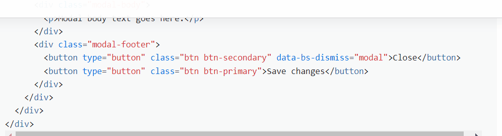

Crea una presentación de bootstrap que solvente las siguientes cuestiones:
* ¿Qué es Bootstrap?¿Para qué sirve?

    Bootstrap es una biblioteca de herramientas de código abierto (acceso gratuito y de libre uso del código fuente) para diseñar el front-end de aplicaciones web.

* ¿Por qué usar Bootstrap?

    Es una buena forma de comenzar tu proyecto sin tener que hacerlo desde cero ya que te ofrece un modelo básico a partir del cual puedes ir haciendo modificaciones para personalizarlo.

* Características de Bootstrap:

    Es _mobile-first_, lo cual significa que el diseño del proyecto comienza desde la vista móvil (ya que es la más restrictiva en cuanto a tamaño) y luego se va expandiendo a tablet y escritorio dado que también es _responsive_.

* Ventajas y desventajas de usar bootstrap:

    Como comentábamos, Bootstrap te ofrece la posibilidad de crear el front-end de tu aplicación web de forma sencilla y gratuita con una gran variedad de componentes a los que puedes acceder desde su código y simplemente copiarlos y pegarlos en el tuyo.

    A su vez, aunque ofrezcan una gran cantidad de diversos componentes, las opciones de personalizar cada uno de ellos son limitadas. Quizá te ofrecen un pequeño grupo de colores o un par de tamaños diferentes entre los que puedes elegir, pero si buscas algo muy específico para uno de esos componentes, personalizarlo puede convertirse en un procedimiento un tanto tedioso.

* Cómo instalar o implementar bootstrap en mi proyecto:

    Bootstrap al fin y al cabo es (de forma muy simplificada) un documento de CSS, así que, al igual que en el resto de nuestros proyectos, lo primero que hay que hacer es conectar dicho documento de CSS a nuestro HTML copiando la hoja de estilos en el head y su script al final del body en el documento HTML en el que vayamos a trabajar. Ejemplo:

    ``` HTML
    <!doctype html>
    <html lang="en">
        <head>
            <meta charset="utf-8">
            <meta name="viewport" content="width=device-width, initial-scale=1">
            <!-- Bootstrap CSS -->
            <link href="https://cdn.jsdelivr.net/npm/bootstrap@5.1.3/dist/css/bootstrap.min.css" rel="stylesheet" integrity="sha384-1BmE4kWBq78iYhFldvKuhfTAU6auU8tT94WrHftjDbrCEXSU1oBoqyl2QvZ6jIW3" crossorigin="anonymous">
            <title>Hello, world!</title>
        </head>
        <body>
            <!-- Bootstrap JavaScript -->
            <script src="https://cdn.jsdelivr.net/npm/bootstrap@5.1.3/dist/js/bootstrap.bundle.min.js" integrity="sha384-ka7Sk0Gln4gmtz2MlQnikT1wXgYsOg+OMhuP+IlRH9sENBO0LRn5q+8nbTov4+1p" crossorigin="anonymous"></script>
        </body>
    </html>
    ```

    Los siguientes pasos serían ir copiando y pegando el código de cada componente que queramos implementar, los cuales podemos encontrar en su índice o a través del buscador que encontramos arriba a la derecha.

    

* ¿Se puede implementar responsive con Bootstrap? Si es asi podrías explicar cómo funciona y poner un ejemplo.

    Como indicábamos antes, los componentes que nos ofrece Bootstrap ya son responsive, así que no hace falta implementar nada extra en tu código. Bootstrap tambien dispone de su propio sistema de grid, que tambien funciona mediante clases, puedes asignarle el hueco que va a ocupar cada elemento y como va a cambiar segun el ancho de la pantalla.

* ¿Que es un componente de bootstrap? Pon un ejemplo:

    Un componente es cada uno de los elementos que te ofrece Bootstrap para implementar en tu proyecto, desde un simple input hasta una barra de navegación completa.

* ¿Hay muchos tipos de diseños en Bootstrap? Si los hay, explícalos:

    Para cada componente, por lo general, te suelen ofrecer algunas opciones con las que puedes cambiar, la forma, el tamaño y/o el color. Por ejemplo, en el apartado de Card encontramos varias tarjetas con formas diferentes y en el de Buttons tenemos hasta 8 colores entre los que elegir.

* ¿Cuáles son los diferentes tipos de botones en bootstrap? Pon ejemplos.

    Bootstrap ofrece gran variedad de alternativas al botón básico, algunos de ellos son:
    
    * Cambiar el color:

    
    ``` HTML
    <button type="button" class="btn btn-primary">Primary</button>
    <button type="button" class="btn btn-secondary">Secondary</button>
    <button type="button" class="btn btn-success">Success</button>
    <button type="button" class="btn btn-danger">Danger</button>
    <button type="button" class="btn btn-warning">Warning</button>
    <button type="button" class="btn btn-info">Info</button>
    <button type="button" class="btn btn-light">Light</button>
    <button type="button" class="btn btn-dark">Dark</button>

    <button type="button" class="btn btn-link">Link</button>
    ```

    * Cambiar el tamaño:
    
    
    ``` HTML
    <button type="button" class="btn btn-primary btn-lg">Large button</button>
    <button type="button" class="btn btn-secondary btn-lg">Large button</button>
    ```

    

    ``` HTML
    <button type="button" class="btn btn-primary btn-sm">Small button</button>
    <button type="button" class="btn btn-secondary btn-sm">Small button</button>
    ```

    * Poner un botón desactivado:
    
    

    ``` HTML
    <button type="button" class="btn btn-lg btn-primary" disabled>Primary button</button>
    <button type="button" class="btn btn-secondary btn-lg" disabled>Button</button>
    ```
    * Estilo block button (Basado en el sistema de Grid de Bootstrap):

    

    ``` HTML
    <div class="d-grid gap-2">
        <button class="btn btn-primary" type="button">Button</button>
        <button class="btn btn-primary" type="button">Button</button>
    </div>
    ```

    * Bootstrap dispone de una amplia variedad de estos botones, para mas informacion puedes entrar a la documentación [este enlace](https://getbootstrap.com/docs/5.1/components/buttons/), tambien dispone de sistemas de agrupacion de botones, puedes ver mas informacion [aquí](https://getbootstrap.com/docs/5.1/components/button-group/)

* ¿Qué es un Carousel de bootstrap? Pon un ejemplo.

    Un Carousel es un conjunto de imágenes las cuales van apareciendo una tras otra de forma cíclica. Bootstrap además te ofrece la posibilidad de incluir indicadores y/o controles de anterior/siguiente así como diferentes opciones de transición entre dichas imágenes.
    En cuanto a las transiciones, Bootstrap tiene de forma predefinida Slides only (una imagen se desliza de derecha a izquierda para sustituir a la anterior), pero si queremos, por ejemplo, que la primera imagen vaya desapareciendo progresivamente mientras la siguiente va apareciendo de la misma forma, podemos implementar un _Crossfade (.carousel-fade)_.

    Este es un ejemplo de un carousel con botones de navegacion:

    

    ``` HTML
    <div id="carouselExampleControls" class="carousel slide" data-bs-ride="carousel">
        <div class="carousel-inner">
            <div class="carousel-item active">
                
            </div>
            <div class="carousel-item">
                
            </div>
            <div class="carousel-item">
                
            </div>
        </div>
            <button class="carousel-control-prev" type="button" data-bs-target="#carouselExampleControls" data-bs-slide="prev">
            <span class="carousel-control-prev-icon" aria-hidden="true"></span>
            <span class="visually-hidden">Previous</span>
        </button>
        <button class="carousel-control-next" type="button" data-bs-target="#carouselExampleControls" data-bs-slide="next">
            <span class="carousel-control-next-icon" aria-hidden="true"></span>
            <span class="visually-hidden">Next</span>
        </button>
    </div>
    ```
    Para mas informacion puedes hacer [click aquí](https://getbootstrap.com/docs/5.1/components/carousel/)

* ¿Qué es un spinner de bootstrap? Pon un ejemplo.

    Este componente es la animación de una circunferencia incompleta que gira sobre sí misma indicando el estado de carga de otro componente o de la aplicación en sí. Bootstrap ofrece opciones en cuanto al color y tamaño y también otro modelo diferente llamado _Growing spinner_ que cumple con la misma función pero con otra apariencia.

    Este es un ejemplo de un spinner de Bootstrap:

    
    ``` HTML
    <div class="spinner-border" role="status">
        <span class="visually-hidden">Loading...</span>
    </div>
    ```
    Para mas informacion puedes hacer [click aquí](https://getbootstrap.com/docs/5.1/components/spinners/)

* ¿Qué es un navBar de bootstrap? Pon un ejemplo.

    Un navBar es la Barra de Navegación que aparece en el header. Dentro de las opciones que nos ofrece Bootstrap, encontramos navBars con espacio para el nombre del proyecto y/o su logo, links de navegación e incluso un buscador.
    Este último se implementaría como un input de un formulario:

    Este es un ejemplo de un navBar completo de Bootstrap:

    
    ``` HTML
    <nav class="navbar navbar-expand-lg navbar-light bg-light">
        <div class="container-fluid">
            <a class="navbar-brand" href="#">Navbar</a>
            <button class="navbar-toggler" type="button" data-bs-toggle="collapse" data-bs-target="#navbarSupportedContent" aria-controls="navbarSupportedContent" aria-expanded="false" aria-label="Toggle navigation">
            <span class="navbar-toggler-icon"></span>
            </button>
            <div class="collapse navbar-collapse" id="navbarSupportedContent">
                <ul class="navbar-nav me-auto mb-2 mb-lg-0">
                    <li class="nav-item">
                        <a class="nav-link active" aria-current="page" href="#">Home</a>
                    </li>
                    <li class="nav-item">
                        <a class="nav-link" href="#">Link</a>
                    </li>
                    <li class="nav-item dropdown">
                        <a class="nav-link dropdown-toggle" href="#" id="navbarDropdown" role="button" data-bs-toggle="dropdown" aria-expanded="false">
                        Dropdown
                        </a>
                        <ul class="dropdown-menu" aria-labelledby="navbarDropdown">
                            <li><a class="dropdown-item" href="#">Action</a></li>
                            <li><a class="dropdown-item" href="#">Another action</a></li>
                            <li><hr class="dropdown-divider"></li>
                            <li><a class="dropdown-item" href="#">Something else here</a></li>
                        </ul>
                    </li>
                    <li class="nav-item">
                        <a class="nav-link disabled">Disabled</a>
                    </li>
                </ul>
                <form class="d-flex">
                    <input class="form-control me-2" type="search" placeholder="Search" aria-label="Search">
                    <button class="btn btn-outline-success" type="submit">Search</button>
                </form>
            </div>
        </div>
    </nav>
    ```

    Además también encontramos modelos con diferentes colores, posiciones y responsividades en [este enlace](https://getbootstrap.com/docs/5.1/components/navbar/)

* ¿Qué es un modal de bootstrap? Pon un ejemplo.

    Son cuadros de diálogo que puedes implementar para que aparezcan como notificaciones. Con Bootstrap podemos añadir en cada modal títulos, texto, botones... así como cambiar la animación, posición y tamaño.
    Así que si, por ejemplo, queremos que el modal aparezca en el centro de la pantalla, podemos cambiar su posición con _.modal-dialog-centered_.

    Este es un ejemplo de un modal de Bootstrap:

    

    ``` HTML
    <div class="modal fade" id="exampleModal" tabindex="-1" aria-labelledby="exampleModalLabel" aria-hidden="true">
        <div class="modal-dialog">
            <div class="modal-content">
                <div class="modal-header">
                    <h5 class="modal-title" id="exampleModalLabel">Modal title</h5>
                    <button type="button" class="btn-close" data-bs-dismiss="modal" aria-label="Close"></button>
                </div>
                <div class="modal-body">
                    <p>Woohoo, you're reading this text in a modal!</p>
                </div>
                <div class="modal-footer">
                    <button type="button" class="btn btn-secondary" data-bs-dismiss="modal">Close</button>
                    <button type="button" class="btn btn-primary">Save changes</button>
                </div>
            </div>
        </div>
    </div>
    ```
    Para mas informacion puedes hacer [click aquí](https://getbootstrap.com/docs/5.1/components/modal/)

* ¿Existen inputs para subir archivos en Bootstrap? Pon un ejemplo.

    En Bootstrap, si accedemos a _Forms_ y luego a _Form control_, encontramos la opción _File input_ donde podemos optar a varios tipos de inputs para subir archivos.
    Entre estos tipos podemos escoger, por ejemplo, la opción _Disabled file input_ que hará que dicho input aparezca desactivado.

    Un simple ejemplo de dichos imputs es el siguiente:
    
    ``` HTML
    <div>
        <label for="formFile" class="form-label">Default file input example</label>
        <input class="form-control" type="file" id="formFile">
    </div>
    ```

* ¿Qué es un plugin scrollspy en Bootstrap? Pon un ejemplo.

    Cuando tienes varias secciones dentro de una página y necesitas hacer scroll debido a la longitud del contenido, Bootstrap te ofrece la posibilidad de implementar un _Scrollspy_ que detectará en qué sección te encuentras y destacará el link correspondiente en la barra de navegación o en un _list-group_ como vemos en el siguiente ejemplo:

    Un ejemplo de este scrollspy es:

    
    ``` HTML
    <div id="list-example" class="list-group">
        <a class="list-group-item list-group-item-action" href="#list-item-1">Item 1</a>
        <a class="list-group-item list-group-item-action" href="#list-item-2">Item 2</a>
        <a class="list-group-item list-group-item-action" href="#list-item-3">Item 3</a>
        <a class="list-group-item list-group-item-action" href="#list-item-4">Item 4</a>
    </div>
    <div data-bs-spy="scroll" data-bs-target="#list-example" data-bs-offset="0" class="scrollspy-example" tabindex="0">
        <h4 id="list-item-1">Item 1</h4>
        <p>...</p>
        <h4 id="list-item-2">Item 2</h4>
        <p>...</p>
        <h4 id="list-item-3">Item 3</h4>
        <p>...</p>
        <h4 id="list-item-4">Item 4</h4>
        <p>...</p>
    </div>
    ```

Extra:

* Implementa nuevos puntos sobre bootstrap que hayas descubierto durante tu investigación y creas que son importantes.

    * Progress

    Es una barra de progreso, con algo de imaginacion se puede animar y que funcione como una barra de carga real.

    
    
